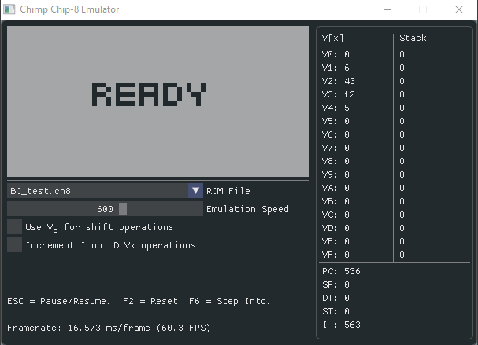

# About
- Chimp is a Chip-8 emulator written in C++. It emulates all of the instructions, including some ambiguous ones, very accurately. There are various sources that document the Chip-8 specifications and the instructions. Some resources that I found useful:
    - [Cowgod's Chip-8 Technical Reference](http://devernay.free.fr/hacks/chip8/C8TECH10.HTM)
    - [Chip-8 Tutorial](https://www.chip-8.com/tutorial)
    - [Massung's info on Chip-8](https://github.com/massung/chip-8)


# Running the emulator
The emulator executable can be found in the Debug folder. For Windows, I've already built a .exe file that will launch the emulator. The process should be the same for other OS's though. In order for the emulator to find ROM files, they should be placed in the 'roms' sub-folder from where the executable is launched. See the Debug folder for reference.

# How to Build
Using the Makefile to build would probably the easiest since it's just a matter of editing the makefile to setup the paths to 
  SDL and tweaking the compiler settings.

Alternately, the whole thing can be built off the command line by specifying the paths and compiler settings directly, like so:

- On Windows with Visual Studio's CLI
```
set SDL2_DIR=path_to_your_sdl2_folder.
cl /Zi /MD /I.. /I..\.. /I%SDL2_DIR%\include main.cpp ..\imgui_impl_sdl.cpp ..\imgui_impl_opengl2.cpp ..\..\imgui*.cpp /FeDebug/example_sdl_opengl2.exe /FoDebug/ /link /libpath:%SDL2_DIR%\lib\x86 SDL2.lib SDL2main.lib opengl32.lib /subsystem:console

Or for 64-bit:
cl /Zi /MD /I.. /I..\.. /I%SDL2_DIR%\include main.cpp ..\imgui_impl_sdl.cpp ..\imgui_impl_opengl2.cpp ..\..\imgui*.cpp /FeDebug/example_sdl_opengl2.exe /FoDebug/ /link /libpath:%SDL2_DIR%\lib\x64 SDL2.lib SDL2main.lib opengl32.lib /subsystem:console
```

- On Windows with GCC (tested with MSYS2):
```
First install MSYS2, gcc and SDL2.
g++ -std=c++17 -I D:\Programs\SDL2-2.0.12\x86_64-w64-mingw32\include\SDL2 -I ./ -I ./imgui Chip8.cpp Chip8Sound.cpp CTexture.cpp main.cpp ./imgui_impl_sdl.cpp ./imgui_impl_opengl2.cpp ./imgui/imgui*.cpp -L"D:\Programs\SDL2-2.0.12\x86_64-w64-mingw32\lib" -L"D:\Programs\msys2\mingw64\lib" -lmingw32 -lSDL2main -lSDL2 -lopengl32 -o ./Debug/Chip8.exe
```

- On Linux and similar distros
```
c++ `sdl2-config --cflags` -I .. -I ../.. main.cpp ../imgui_impl_sdl.cpp ../imgui_impl_opengl2.cpp ../../imgui*.cpp `sdl2-config --libs` -lGL
```

- On Mac OS X
```
brew install sdl2.
c++ `sdl2-config --cflags` -I .. -I ../.. main.cpp ../imgui_impl_sdl.cpp ../imgui_impl_opengl2.cpp ../../imgui*.cpp `sdl2-config --libs` -framework OpenGl

g++ -std=c++17 -I D:\Programs\SDL2-2.0.12\x86_64-w64-mingw32\include\SDL2 -I ./imgui main.cpp ./imgui_impl_sdl.cpp ./imgui_impl_opengl2.cpp ./imgui/imgui*.cpp  -L"D:\Programs\SDL2-2.0.12\x86_64-w64-mingw32\lib" -L"D:\Programs\msys2\mingw64\lib"  -lstdc++ -lmingw32 -lSDL2
```
